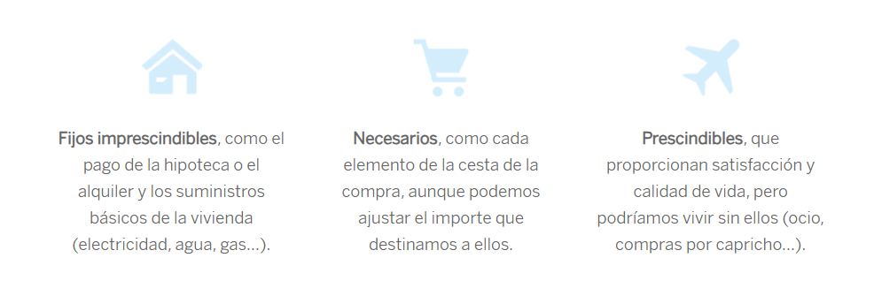

# Creación y Gestión de Presupuestos

## ¿Qué es un Presupuesto?
Un presupuesto es una herramienta esencial de planificación financiera que permite gestionar de manera eficiente los ingresos y gastos. Consiste en un plan detallado que asigna recursos a diferentes categorías, ayudando a alcanzar objetivos económicos y mantener el control financiero.

Los principales beneficios de un presupuesto incluyen:
- **Organización financiera**: Ayuda a visualizar en qué se gastan los recursos y permite identificar áreas de mejora.
- **Prevención de deudas**: Garantiza que los gastos no excedan los ingresos disponibles.
- **Alcance de metas**: Facilita destinar recursos a objetivos específicos como ahorro, inversión o pago de deudas.

El proceso para crear un presupuesto efectivo implica:
- **Identificar ingresos totales**.
- **Categorizar gastos** (fijos, variables y discrecionales).
- **Asignar límites** a cada categoría basados en prioridades y objetivos.
- **Revisar y ajustar regularmente** para adaptarse a cambios en los ingresos o necesidades.

Un presupuesto bien diseñado no solo mejora la salud financiera, sino que también reduce el estrés asociado a la gestión de recursos económicos.

## Métodos para crear un presupuesto
- Identificar cuanto se gana al mes
- Regla 50, 30, 20
    - 50% → necesidades: alquiler, comida, transporte, etc.
    - 30% → deseos: salidas, cine, etc.
    - 20% → ahorro
- Sistema de sobres

## Herramientas para registrar gastos
Existen diversas aplicaciones digitales que simplifican el seguimiento de gastos, ofreciendo características diseñadas para registrar, analizar y optimizar el uso de los recursos financieros. A continuación, una comparativa de tres herramientas populares:

- **Mint**:
    - **Características principales**: Vincula cuentas bancarias, categoriza automáticamente gastos y ofrece alertas de presupuesto.
    - **Ventajas**: Interfaz intuitiva y funcionalidad gratuita.
    - **Ideal para**: Usuarios que buscan una visión global de sus finanzas en un solo lugar.

- **YNAB** (You Need a Budget):
    - **Características principales**: Basada en la asignación de cada dólar a una categoría específica, enfatiza la planificación proactiva.
    - **Ventajas**: Filosofía educativa para el manejo del dinero y sincronización en tiempo real.
    - **Ideal para**: Personas que desean aprender y adoptar hábitos financieros sólidos.

- **GoodBudget**:
    - **Características principales**: Utiliza el sistema de sobres digitales para distribuir ingresos en categorías específicas.
    - **Ventajas**: Fácil de usar y excelente para quienes prefieren métodos visuales.
    - **Ideal para**: Usuarios que desean un enfoque sencillo y efectivo para administrar gastos.

👉 Estas herramientas permiten llevar un control detallado de los gastos, optimizando el presupuesto y ayudando a alcanzar objetivos financieros personales o familiares.

