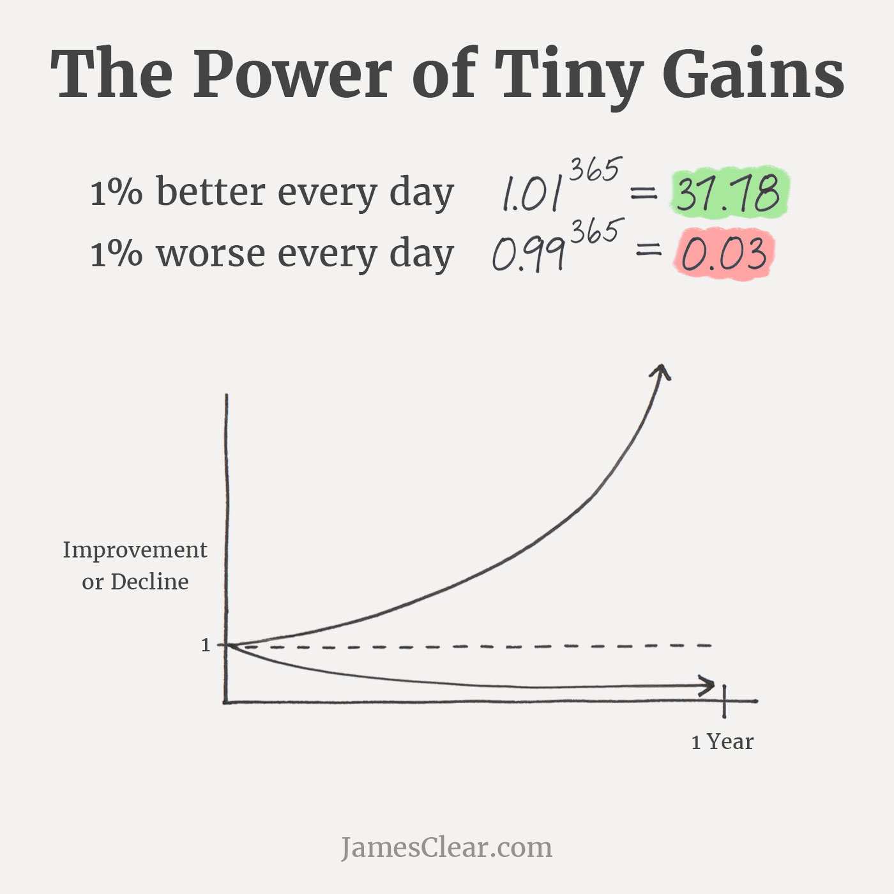

# Crear sistemas es más importante que establecer metas
Los sistemas son escalables y repetibles. Si bien establecer metas es importante, si no está creando un proceso para lograrlas continuamente, fracasará más a menudo.

Para muchos de nosotros, somos creadores de metas en serie. Nos resulta fácil establecer metas y nos encanta soñar en grande. Sin embargo, cuando se trata de alcanzar esos objetivos, eso es otro asunto.

El problema no es su capacidad para establecer metas. En cambio, nuestra incapacidad para alcanzar esos objetivos a menudo se reduce a nuestro modus operandi, nuestro sistema para alcanzarlos.

¿Qué quiero decir con sistema? Piense en ello como su plan de acción, la ruta que va a seguir, un conjunto de pasos que toma a diario. Es el "cómo" de alcanzar su objetivo y obtener los resultados que desea.

Ahora bien, no es que no debas establecer metas. Las metas también son importantes. Después de todo, son la dirección que desea tomar y pueden ayudarlo a mantenerse en el carril correcto. Pero es importante pensar en sus objetivos como una guía útil para la Estrella del Norte. Tu objetivo, por así decirlo. Mientras que el sistema que acabas implementando es el arco y la flecha; y cómo terminarás dando en el blanco.

Al crear sistemas y establecer buenos hábitos hoy, estará más cerca de lograr sus objetivos y también se preparará para el éxito a largo plazo. Teniendo esto en cuenta, aquí se muestra por qué la implementación de sistemas es más importante que el solo establecimiento de objetivos.

## Te prepara para la mejora continua
Con un buen sistema, se estará preparando para la mejora continua.

¿Cómo? Porque llevar a cabo una serie de hábitos diarios le permite realmente progresar, no solo pensar en ese progreso como lo hace cuando establece metas. También es sostenible y puede volver a visitar su sistema de forma continua si es necesario, modificando, mejorando o creando nuevos hábitos para obtener los resultados que desea.

Como explica Steven Handel, autor y entrenador de superación personal de The Emotion Machine , "Los sistemas son diferentes de las metas porque están enfocados en la sustentabilidad . Los sistemas no requieren un punto de referencia específico que alcancemos o no alcancemos. Son un enfoque de la vida que practicamos y construimos a diario".

## Es escalable
Su objetivo puede ser construir un negocio próspero, pero sus sistemas son la forma en que realmente lo hará. Son los procedimientos sobre cómo crear productos, contratar empleados y llevar cuentas. Estos son los pequeños ajustes del método que le permitirán escalar.

Es por eso que los sistemas son tan cruciales y mejores que el solo establecimiento de objetivos. Si logra su objetivo, digamos, lanzar y escalar un negocio exitoso, pero luego olvida cómo llegó allí, entonces el objetivo no es escalable. En cambio, es mejor sistematizar su enfoque para que, si falla, pueda ejecutar rápidamente una autopsia para ver dónde se equivocó. De esta manera, sabrá qué no hacer en el futuro. Y cuando gane, tendrá un sistema documentado sobre cómo lograrlo nuevamente y hacerlo mejor la próxima vez.

## Puede reunir a su equipo en torno al plan
Los objetivos generales son geniales, pero puede ser difícil lograr que su equipo se entusiasme con ellos. Por otro lado, con los sistemas, puede mostrarle a su equipo el plano de su empresa y hacer que se unan a usted.

Si puede, haga que su equipo se involucre en la creación de los sistemas con usted. Hagan una lluvia de ideas y muéstrenles que tener una guía paso a paso para completar las tareas les facilitará la vida. Crea eficiencia porque sabrán qué hacer, cómo hacerlo y cuándo.

Y a medida que su empresa crezca y contrate nuevos empleados, será fácil para ellos adquirir los conocimientos y los procedimientos que ya tiene implementados.

## Permite aportaciones creativas
"Alcanzaré $ 200,000 en ingresos este año". Ese es un gran objetivo, pero ¿qué significa realmente y cómo se puede actuar? Es lo que vas a hacer lo que cuenta.

Piense creativamente en la implementación de nuevos sistemas. Incluso si hay un cambio del uno por ciento en la forma de hacer las cosas, la acumulación de todos estos pequeños cambios marcará la diferencia.

Solo eche un vistazo al equipo de ciclismo británico : hicieron pequeños cambios creativos, como cambiar a un sillín más cómodo, pero la acumulación de todos los cambios valió la pena (alerta de spoiler: tienen seis victorias en el Tour de Francia ).

## Crea una mentalidad a largo plazo
Has entrenado duro y has corrido tu maratón. Pero ahora que Has logrado tu objetivo, entonces, ¿qué te motiva a mantener buenos hábitos de carrera?

Centrarse en un sistema le permite seguir haciéndolo bien después de que se ha logrado una meta porque no se trata de un logro singular.

Es el compromiso con el proceso, y una vez que se crea y mantiene un buen hábito, verá cómo beneficia a su empresa. Tendrás el incentivo de seguir haciéndolo porque sigues viendo las recompensas. Esta es la mentalidad a largo plazo que desea.

"El propósito de establecer metas es ganar el juego", dice James Clear, autor de best-sellers de varios libros, incluido Atomic Habits . "El propósito de construir sistemas es seguir jugando ... el verdadero pensamiento a largo plazo es el pensamiento sin objetivos". ¡Eso es revolucionario!

## Te mantiene conectado a tierra
Finalmente, un sistema lo mantiene orientado a la acción porque ve el progreso que se está haciendo. Es tangible y brinda más satisfacción y felicidad a largo plazo.

Si basa su felicidad en lograr una meta, se está diciendo a sí mismo: " SI alcanzo mi meta, solo ENTONCES podré ser feliz".

Pero aquí está la cuestión, ¿por qué no permitirse ser feliz y estar conectado a tierra todo el tiempo?

Al implementar un sistema, el objetivo ahora es el resultado de todos los procedimientos procesables que ha realizado. También pasará de una mentalidad de fracaso a una en la que le complace ver que sus sistemas funcionan bien y, como resultado, se cumplen sus objetivos generales.

Y esto es lo que lo motivará y lo conducirá al éxito continuo a largo plazo, tanto en su vida personal como en su negocio.