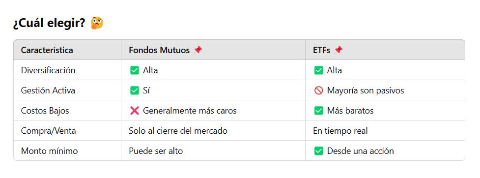

# Cuáles son los principales desafíos que enfrentan las personas al intentar establecer y cumplir objetivos financieros a largo plazo, como la jubilación o la compra de una vivienda, y cómo pueden superar estos obstáculos?

Los principales desafíos que enfrentan las personas al intentar establecer y cumplir objetivos financieros a largo plazo incluyen:

1. **Falta de planificación y educación financiera**
Muchas personas no tienen conocimientos sólidos sobre inversión, presupuestos o planificación financiera, lo que dificulta establecer metas realistas.
- Cómo superarlo:
    - Aprender sobre finanzas personales a través de libros, cursos o asesores financieros.
    - Usar herramientas como hojas de cálculo o aplicaciones de gestión financiera.

2. **Procrastinación y falta de disciplina**
Postergar el ahorro o la inversión puede hacer que se pierda tiempo valioso en la acumulación de capital.
- Cómo superarlo:
    - Automatizar ahorros e inversiones para que se realicen sin intervención manual.
    - Establecer metas SMART (específicas, medibles, alcanzables, relevantes y con un tiempo definido).

3. **Gastos imprevistos y emergencias**
Situaciones inesperadas, como problemas de salud o desempleo, pueden afectar los ahorros destinados a objetivos de largo plazo.
- Cómo superarlo:
    - Crear un fondo de emergencia equivalente a 3-6 meses de gastos.
    - Contratar seguros adecuados para reducir riesgos financieros.

4. **Inflación y cambios económicos**
El aumento en el costo de vida y las crisis económicas pueden reducir el poder adquisitivo del dinero ahorrado.
- Cómo superarlo:
    - Invertir en activos que superen la inflación, como fondos indexados, acciones o bienes raíces.
    - Diversificar inversiones para mitigar riesgos.    

5. **Falta de seguimiento y ajuste de la estrategia**
No revisar periódicamente el progreso puede llevar a desviaciones en el plan financiero.
- Cómo superarlo:
    - Revisar metas y estrategias cada 6-12 meses.
    - Ajustar las inversiones y los ahorros según las condiciones económicas y personales.

6. **Presión social y tentaciones de consumo**
Los hábitos de consumo influenciados por la sociedad pueden hacer que las personas gasten más de lo necesario.
- Cómo superarlo:
    - Priorizar el bienestar financiero sobre el consumo inmediato.
    - Aplicar la "regla de las 48 horas" antes de hacer compras impulsivas.

En resumen, la clave para superar estos desafíos es la **educación financiera, la disciplina y la planificación estratégica** 🚀

--- 
# ¿Qué ventajas ofrecen los fondos mutuos y los ETFs en comparación con la inversión directa en acciones o bonos, especialmente para inversores principiantes?

Los fondos mutuos y los ETFs (fondos cotizados en bolsa) ofrecen varias ventajas sobre la inversión directa en acciones o bonos, especialmente para inversores principiantes. Aquí te explico las principales:

1. **Diversificación instantánea** 🏦📊
- Ventaja: Los fondos mutuos y los ETFs agrupan múltiples activos (acciones, bonos, etc.), lo que reduce el riesgo en comparación con comprar solo unas pocas acciones o bonos.
- Ejemplo: Si inviertes en un ETF del S&P 500, tu dinero se distribuye en 500 empresas diferentes, minimizando el impacto si una empresa tiene malos resultados.

2. **Gestión profesional** 📈👨‍💼
- Ventaja: Los fondos mutuos y algunos ETFs son administrados por expertos financieros que seleccionan y ajustan los activos según las condiciones del mercado.
- Ejemplo: Un fondo de renta fija ajusta su cartera de bonos para optimizar rendimientos y reducir riesgos según las tasas de interés.

3. **Menores costos y accesibilidad** 💰
- Ventaja:
    - **Fondos mutuos**: Permiten invertir con cantidades pequeñas, ideales para principiantes.
    - **ETFs**: Tienen comisiones más bajas que los fondos mutuos y se pueden comprar/vender como acciones.

- Ejemplo: Con $100 puedes invertir en un ETF de tecnología, obteniendo exposición a grandes empresas como Apple y Microsoft sin comprar cada acción individualmente.

4. **Facilidad de compra y venta** 🏦⚡
- Ventaja:
     - **ETFs**: Se negocian en bolsa en tiempo real, como las acciones.
    - **Fondos mutuos**: Se compran/venden al cierre del mercado, pero permiten aportes automáticos.

- Ejemplo: Si quieres vender un ETF de energía renovable, puedes hacerlo en cualquier momento del día con un solo clic.

5. **Reinversión automática de dividendos** 📊🔄
- Ventaja: Muchos fondos mutuos y ETFs permiten reinvertir dividendos automáticamente, aumentando el crecimiento compuesto de la inversión.
- Ejemplo: Si un ETF de dividendos paga $10 en dividendos, esos $10 se reinvierten para comprar más participaciones, generando mayores ganancias a largo plazo.

---
