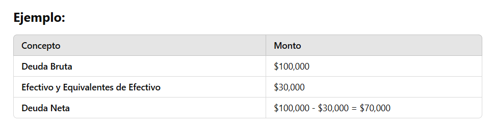
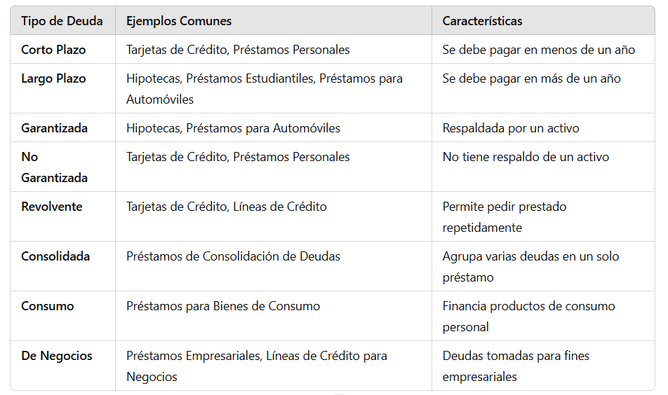

# Cuáles son los principales desafíos que enfrentan las personas al intentar establecer y cumplir objetivos financieros a largo plazo, como la jubilación o la compra de una vivienda, y cómo pueden superar estos obstáculos?

Los principales desafíos que enfrentan las personas al intentar establecer y cumplir objetivos financieros a largo plazo incluyen:

1. **Falta de planificación y educación financiera**
Muchas personas no tienen conocimientos sólidos sobre inversión, presupuestos o planificación financiera, lo que dificulta establecer metas realistas.
- Cómo superarlo:
    - Aprender sobre finanzas personales a través de libros, cursos o asesores financieros.
    - Usar herramientas como hojas de cálculo o aplicaciones de gestión financiera.

2. **Procrastinación y falta de disciplina**
Postergar el ahorro o la inversión puede hacer que se pierda tiempo valioso en la acumulación de capital.
- Cómo superarlo:
    - Automatizar ahorros e inversiones para que se realicen sin intervención manual.
    - Establecer metas SMART (específicas, medibles, alcanzables, relevantes y con un tiempo definido).

3. **Gastos imprevistos y emergencias**
Situaciones inesperadas, como problemas de salud o desempleo, pueden afectar los ahorros destinados a objetivos de largo plazo.
- Cómo superarlo:
    - Crear un fondo de emergencia equivalente a 3-6 meses de gastos.
    - Contratar seguros adecuados para reducir riesgos financieros.

4. **Inflación y cambios económicos**
El aumento en el costo de vida y las crisis económicas pueden reducir el poder adquisitivo del dinero ahorrado.
- Cómo superarlo:
    - Invertir en activos que superen la inflación, como fondos indexados, acciones o bienes raíces.
    - Diversificar inversiones para mitigar riesgos.    

5. **Falta de seguimiento y ajuste de la estrategia**
No revisar periódicamente el progreso puede llevar a desviaciones en el plan financiero.
- Cómo superarlo:
    - Revisar metas y estrategias cada 6-12 meses.
    - Ajustar las inversiones y los ahorros según las condiciones económicas y personales.

6. **Presión social y tentaciones de consumo**
Los hábitos de consumo influenciados por la sociedad pueden hacer que las personas gasten más de lo necesario.
- Cómo superarlo:
    - Priorizar el bienestar financiero sobre el consumo inmediato.
    - Aplicar la "regla de las 48 horas" antes de hacer compras impulsivas.

En resumen, la clave para superar estos desafíos es la **educación financiera, la disciplina y la planificación estratégica** 🚀

--- 
# ¿Qué ventajas ofrecen los fondos mutuos y los ETFs en comparación con la inversión directa en acciones o bonos, especialmente para inversores principiantes?

Los fondos mutuos y los ETFs (fondos cotizados en bolsa) ofrecen varias ventajas sobre la inversión directa en acciones o bonos, especialmente para inversores principiantes. Aquí te explico las principales:

1. **Diversificación instantánea** 🏦📊
- Ventaja: Los fondos mutuos y los ETFs agrupan múltiples activos (acciones, bonos, etc.), lo que reduce el riesgo en comparación con comprar solo unas pocas acciones o bonos.
- Ejemplo: Si inviertes en un ETF del S&P 500, tu dinero se distribuye en 500 empresas diferentes, minimizando el impacto si una empresa tiene malos resultados.

2. **Gestión profesional** 📈👨‍💼
- Ventaja: Los fondos mutuos y algunos ETFs son administrados por expertos financieros que seleccionan y ajustan los activos según las condiciones del mercado.
- Ejemplo: Un fondo de renta fija ajusta su cartera de bonos para optimizar rendimientos y reducir riesgos según las tasas de interés.

3. **Menores costos y accesibilidad** 💰
- Ventaja:
    - **Fondos mutuos**: Permiten invertir con cantidades pequeñas, ideales para principiantes.
    - **ETFs**: Tienen comisiones más bajas que los fondos mutuos y se pueden comprar/vender como acciones.

- Ejemplo: Con $100 puedes invertir en un ETF de tecnología, obteniendo exposición a grandes empresas como Apple y Microsoft sin comprar cada acción individualmente.

4. **Facilidad de compra y venta** 🏦⚡
- Ventaja:
     - **ETFs**: Se negocian en bolsa en tiempo real, como las acciones.
    - **Fondos mutuos**: Se compran/venden al cierre del mercado, pero permiten aportes automáticos.

- Ejemplo: Si quieres vender un ETF de energía renovable, puedes hacerlo en cualquier momento del día con un solo clic.

5. **Reinversión automática de dividendos** 📊🔄
- Ventaja: Muchos fondos mutuos y ETFs permiten reinvertir dividendos automáticamente, aumentando el crecimiento compuesto de la inversión.
- Ejemplo: Si un ETF de dividendos paga $10 en dividendos, esos $10 se reinvierten para comprar más participaciones, generando mayores ganancias a largo plazo.

**Conclusión** 🏆
Para principiantes, los fondos mutuos y ETFs son excelentes opciones porque ofrecen diversificación, costos bajos y gestión profesional.
- Si buscas bajos costos y flexibilidad, los ETFs son mejores.
- Si prefieres gestión activa y reinversión automática, los fondos mutuos pueden ser una opción sólida.

---

# ¿Cuál es uno de los factores menos importantes que afectan tu puntuación de crédito?

Uno de los factores menos importantes que afectan tu puntuación de crédito es la consulta de crédito blanda (soft inquiry).

- ¿Qué es una consulta de crédito blanda?
Es cuando una empresa, institución financiera o tú mismo revisan tu historial crediticio sin que estés solicitando un nuevo crédito.

- Ejemplos de consultas blandas:
    - ✅ Revisar tu propia puntuación en una app financiera (como Credit Karma).
    - ✅ Un empleador que verifica tu historial de crédito como parte de un proceso de contratación.
    - ✅ Una entidad financiera que preaprueba una tarjeta de crédito para enviarte una oferta.

📌 **Importante**: A diferencia de las consultas de crédito duras (hard inquiries), que ocurren cuando solicitas un préstamo o tarjeta de crédito y pueden afectar tu puntaje, las consultas blandas no impactan tu crédito.

Si bien **tienen registro en tu informe crediticio**, no influyen en la calificación porque no representan un riesgo financiero. 🚀

--- 

# ¿Qué significa la tasa de uso de crédito? 

La tasa de uso de crédito (o utilización de crédito) es el porcentaje del crédito disponible que estás utilizando en un momento dado. Es un factor clave en tu puntaje de crédito, ya que representa tu nivel de deuda en relación con tu límite de crédito.

- **Cómo se calcula la tasa de uso de crédito**
Se calcula dividiendo el saldo total de tus tarjetas de crédito entre el crédito total disponible y multiplicando por 100.

📌 **Fórmula**:

- **Ejemplo de cálculo**
Imagina que tienes dos tarjetas de crédito:
- **Tarjeta 1**: Límite de $5,000, saldo usado: $1,500
- **Tarjeta 2**: Límite de $10,000, saldo usado: $2,500

- **Crédito total disponible**: $5,000 + $10,000 = $15,000
- **Saldo total usado**: $1,500 + $2,500 = $4,000

Tasa de uso de crédito:

- **¿Por qué es importante la tasa de uso de crédito?**
    - **Impacta tu puntaje de crédito**: Es uno de los factores más importantes en la calificación crediticia.
    - **Cuanto más baja, mejor**: Se recomienda mantenerla por debajo del 30% para no afectar negativamente tu crédito.
    - **Indica tu nivel de endeudamiento**: Los prestamistas lo usan para evaluar tu capacidad de pago antes de otorgar nuevos créditos.

📌 **Consejo**: Pagar saldos antes del cierre del estado de cuenta puede reducir tu tasa de uso de crédito y mejorar tu puntaje. 🚀

--- 

# ¿Cuál es una estrategia recomendada para mejorar tu puntaje de crédito?
Una de las mejores estrategias para mejorar tu puntaje de crédito es mantener baja tu tasa de uso de crédito (preferiblemente por debajo del 30%).

- Cómo aplicar esta estrategia:
    - ✅ **Paga más de una vez al mes**: Realizar pagos parciales antes del cierre del estado de cuenta reduce el saldo reportado a las agencias de crédito.
    - ✅ **Aumenta tu límite de crédito**: Solicitar un aumento de límite en tus tarjetas (sin gastar más) reduce tu tasa de uso de crédito.
    - ✅ **Usa varias tarjetas de forma equilibrada**: En lugar de cargar todo a una sola tarjeta, reparte tus gastos entre varias.

📌 **Ejemplo**:
- Si tienes un límite total de $10,000 y un saldo de $4,000, tu tasa de uso de crédito es del 40%.
- Si pagas $2,000 antes del cierre del estado de cuenta, tu saldo bajará a $2,000, reduciendo tu tasa al 20% y mejorando tu puntaje.
- Si solicitas un aumento de crédito a $15,000 y mantienes el mismo saldo de $4,000, tu tasa baja al 26.67%.

📌 **Bonus Tip**: También es clave pagar siempre a tiempo, ya que el historial de pagos es el factor más importante en tu puntaje de crédito. 🚀

--- 

# ¿Cuál es un tipo de crédito que puede tener un impacto positivo en tu puntuación de crédito?
Un crédito a plazos (como un préstamo para automóvil, hipoteca o préstamo estudiantil) puede tener un impacto positivo en tu puntuación de crédito si se maneja correctamente.

- **¿Por qué ayuda un crédito a plazos?**
    - ✅ Diversifica tu historial crediticio 📊 – Los prestamistas valoran una combinación de créditos a plazos y créditos rotativos (como tarjetas de crédito). Tener ambos tipos mejora tu perfil crediticio.
    - ✅ Demuestra tu capacidad de pago 💰 – Pagar puntualmente cada mes construye un buen historial de pagos, el factor más importante en tu puntaje.
    - ✅ Puede mejorar tu tasa de uso de crédito 📉 – A diferencia de las tarjetas de crédito, un préstamo a plazos no afecta la tasa de uso de crédito, lo que ayuda a mantener tu puntaje alto.

📌 **Ejemplo práctico**: Si solo tienes tarjetas de crédito, agregar un préstamo estudiantil o un financiamiento de auto y pagarlo puntualmente puede fortalecer tu historial.

🚀 **Clave**: Para maximizar el impacto positivo, asegúrate de hacer todos los pagos a tiempo y evitar deudas excesivas.

--- 

# ¿Cuál es la diferencia entre deuda financiera bruta y deuda financiera neta?
La diferencia entre deuda financiera bruta y deuda financiera neta radica en cómo se contabilizan los activos financieros disponibles en una empresa o individuo para reducir la deuda total.

1. **Deuda Financiera Bruta** 💳
- **Definición**: Es el total de las obligaciones de deuda que una empresa o individuo tiene, sin considerar los activos disponibles.
- **Componentes típicos**: Incluye préstamos bancarios, bonos emitidos, líneas de crédito, préstamos a corto y largo plazo, entre otros.
- **Importancia**: Refleja el monto total de la deuda sin tener en cuenta la capacidad para pagarla (es decir, sin restar los activos líquidos).

2. **Deuda Financiera Neta** 💰
- **Definición**: Es el total de la deuda financiera bruta menos los activos líquidos que una empresa o individuo tiene (por ejemplo, efectivo y equivalentes de efectivo).
- **Fórmula**:

- **Importancia**: Muestra una visión más realista de la carga neta de deuda, ya que tiene en cuenta la disponibilidad de dinero en efectivo o activos líquidos para reducir la deuda.

**¿Por qué es importante?**
- **Deuda Financiera Bruta**: Da una idea del total de la deuda que alguien tiene.
- **Deuda Financiera Neta**: Proporciona una imagen más precisa de cuánto efectivo está disponible para pagar esa deuda, lo que ayuda a evaluar la capacidad real de la persona o empresa para enfrentar sus obligaciones.

💡 **En resumen**: La deuda neta es más útil para evaluar la solvencia real, ya que considera los activos líquidos disponibles para pagar la deuda.

---

# ¿Qué aspectos son relevantes al calcular la deuda financiera de una persona?
Al calcular la deuda financiera de una persona, hay varios aspectos clave que deben ser considerados para obtener una imagen clara de su situación financiera. Aquí te menciono los aspectos más relevantes:

1. **Tipo de deuda**
- **Deudas a corto plazo**: Como tarjetas de crédito, préstamos personales o cualquier obligación que deba pagarse en un plazo menor a un año.
- **Deudas a largo plazo**: Hipotecas, préstamos estudiantiles, préstamos para auto, etc., que tienen un plazo de pago más largo (generalmente superior a un año).

2. **Monto total de la deuda**
Es el saldo pendiente de todas las deudas financieras que la persona tiene. Esto incluye tanto los préstamos como las líneas de crédito y cualquier tipo de financiamiento.

3. **Intereses y tasas aplicadas**
Las tasas de interés influyen significativamente en el costo total de la deuda. Las deudas con tasas de interés altas, como las tarjetas de crédito, pueden acumular grandes cantidades de interés, aumentando el monto total que debe ser pagado.

4. **Pagos mensuales**
Es importante conocer los pagos mensuales obligatorios para cada deuda. Un cálculo de deuda financiera también debe tener en cuenta la capacidad de la persona para cumplir con estos pagos sin afectar su flujo de efectivo.

5. **Activos líquidos disponibles**
Efectivo y equivalentes de efectivo (por ejemplo, cuentas bancarias, ahorros, inversiones de bajo riesgo) que se pueden usar para pagar la deuda. Esto es importante para calcular la deuda neta, ya que el efectivo disponible puede reducir la deuda financiera total.

6. **Capacidad de pago (ingresos vs. deuda)**
Es fundamental comparar los ingresos regulares con los pagos de deuda. Esto permite determinar la capacidad de pago mensual y evaluar si la persona está viviendo por encima de sus posibilidades, lo que podría afectar su salud financiera a largo plazo.

7. **Historial de pagos**
El historial de pagos de la persona también es relevante para comprender la calidad de la deuda. Los pagos atrasados o incumplidos pueden generar penalidades adicionales o afectar negativamente el puntaje de crédito.

8. **Consolidación de deudas**
En algunos casos, una persona puede optar por consolidar sus deudas. Esto implica combinar múltiples deudas en un solo préstamo, generalmente con una tasa de interés más baja. Al calcular la deuda financiera, se debe tener en cuenta si la persona tiene acceso a este tipo de soluciones.

**En resumen**:
Para calcular la deuda financiera de una persona, es esencial tener en cuenta el total de la deuda, el tipo de deuda, las tasas de interés, los pagos mensuales, los activos disponibles, y la capacidad de pago. Estos aspectos no solo ayudan a conocer cuánto se debe, sino también a entender la capacidad real de pago y la salud financiera general.

---

# Cuáles son los tipos de deuda financiera que una persona puede tener?

Una persona puede tener diferentes tipos de deuda financiera, que se agrupan generalmente según su plazo y naturaleza. Aquí te presento los principales tipos:

1. **Deuda a Corto Plazo**
Estas deudas deben ser pagadas en un plazo de menos de un año. Son comunes para necesidades inmediatas o de corto período.
- **Tarjetas de Crédito**: Son líneas de crédito rotativo que permiten a las personas realizar compras hasta un límite específico. El saldo que no se paga a tiempo genera intereses, que suelen ser altos.
- **Préstamos Personales**: Son préstamos a corto plazo, generalmente no garantizados, que se utilizan para cubrir necesidades inmediatas, como emergencias o compras importantes.
- **Líneas de Crédito**: Similar a las tarjetas de crédito, pero pueden ser más flexibles. Permiten retirar fondos hasta un límite acordado y se pueden pagar y volver a utilizar según se necesite.

2. **Deuda a Largo Plazo**
Este tipo de deuda tiene un plazo superior a un año y, generalmente, involucra montos mayores.
- **Hipotecas**: Préstamos a largo plazo utilizados para la compra de viviendas. La vivienda misma actúa como garantía del préstamo.
- **Préstamos Estudiantiles**: Son créditos a largo plazo para financiar estudios superiores. Tienen plazos largos, con pagos que suelen comenzar después de la graduación.
- **Préstamos para Automóviles**: Créditos a largo plazo utilizados para financiar la compra de un automóvil. La propiedad del vehículo se utiliza como garantía.
- **Préstamos Personales a Largo Plazo**: Algunos préstamos personales se extienden por varios años, como los préstamos para reformas en el hogar.

3. **Deuda Garantizada**
Este tipo de deuda está respaldada por un activo, lo que implica que el prestamista tiene el derecho de tomar ese activo si no se paga la deuda.
- **Hipotecas**: Como mencionamos antes, las hipotecas son préstamos garantizados por la propiedad de una vivienda.
- **Préstamos para Automóviles**: El vehículo adquirido actúa como garantía en caso de incumplimiento del préstamo.

4. **Deuda No Garantizada**
A diferencia de la deuda garantizada, este tipo de deuda no está respaldada por ningún activo. Los prestamistas no tienen ningún activo específico que tomar si no se paga.
- **Tarjetas de Crédito**: Son ejemplos clásicos de deuda no garantizada.
- **Préstamos Personales**: Generalmente no requieren ningún tipo de garantía, lo que los convierte en deuda no garantizada.
- **Préstamos para Estudiantes**: Aunque algunos préstamos estudiantiles pueden tener garantías, en muchos casos, son considerados no garantizados.

5. **Deuda Revolvente**
La deuda revolvente permite al prestatario pedir prestado, pagar y luego volver a pedir prestado dentro del límite de crédito disponible.
- **Tarjetas de Crédito**: El saldo de la tarjeta puede renovarse cada mes si no se paga el total, acumulando intereses.
- **Líneas de Crédito**: Similar a las tarjetas, permiten retirar fondos hasta un límite preestablecido y realizar pagos periódicos.

6. **Deuda Consolidada**
Cuando una persona combina varias deudas en un solo préstamo para facilitar su manejo y, generalmente, reducir los pagos mensuales o las tasas de interés.
- **Préstamos de Consolidación de Deudas**: Se utilizan para agrupar varias deudas en una sola, a menudo con un interés más bajo, lo que simplifica el pago de múltiples deudas.

7. **Deuda de Consumo**
Este tipo de deuda se utiliza para financiar bienes o servicios, como bienes de consumo duradero, viajes, entretenimiento, etc.
- **Préstamos para Bienes de Consumo**: Utilizados para financiar productos como electrodomésticos, muebles, etc.
- **Préstamos para Vacaciones**: Préstamos personales que se toman para financiar viajes o experiencias.

8. **Deuda de Negocios** (para emprendedores o autónomos)
En caso de que una persona sea dueña de un negocio, puede contraer deuda empresarial, que puede ser tanto a corto como a largo plazo, y puede estar garantizada o no.
- **Préstamos Empresariales**: Préstamos solicitados para financiar el funcionamiento de un negocio o para inversiones en expansión.
- **Líneas de Crédito para Negocios**: Similar a las líneas de crédito personales, pero enfocadas en las necesidades de financiamiento empresarial.

**Resumen de los Tipos de Deuda:**

**Conclusión**:
Existen diversas formas de deuda financiera que una persona puede adquirir, y cada una tiene características diferentes en cuanto a plazos, tasas de interés y garantías. Manejar estas deudas de manera responsable es clave para mantener una buena salud financiera.

--- 

# ¿Cuáles son los principales tipos de cartera de inversión según el riesgo y la estrategia de inversión?
Las carteras de inversión se clasifican según el riesgo que asume el inversor y la estrategia de inversión que sigue. A continuación, se describen los principales tipos de carteras de inversión según estos dos criterios:

1. **Cartera Conservadora** (Baja Riesgo)
- **Objetivo**: Minimizar el riesgo de pérdidas y preservar el capital, con un enfoque en la estabilidad.
- **Composición**:
    - Bonos gubernamentales (deuda soberana de países con alta calificación crediticia).
    - Bonos corporativos de empresas de alta calidad (grado de inversión).
    - Depósitos a plazo y cuentas de ahorro.
    - Acciones de empresas grandes y estables (aunque con menor porcentaje, dado que las acciones suelen ser más volátiles).
- **Riesgo**: Bajo. La cartera está orientada a generar ingresos fijos a través de intereses y dividendos, pero con pocas fluctuaciones en el valor de la inversión.
- **Rentabilidad esperada**: Baja, pero más predecible y estable.

2. **Cartera Moderada (Riesgo Medio)**
- **Objetivo**: Buscar un equilibrio entre el crecimiento del capital y la protección del mismo, aceptando un riesgo moderado a cambio de una rentabilidad razonable.
- **Composición**:
    - 60-70% de renta fija (bonos gubernamentales y corporativos, preferentemente de empresas con buena calificación).
    - 30-40% de acciones (en su mayoría, empresas con un crecimiento estable y, posiblemente, fondos indexados que replican mercados amplios).
    - Algunos activos alternativos (por ejemplo, fondos inmobiliarios, commodities o fondos de inversión diversificados).
- **Riesgo**: Moderado. Aunque hay un grado de volatilidad, el impacto de las pérdidas no suele ser drástico debido a la porción significativa de activos más seguros.
- **Rentabilidad esperada**: Media, con fluctuaciones periódicas, pero la cartera está diseñada para ser más estable que una cartera de alto riesgo.

3. **Cartera Agresiva** (Alto Riesgo)
- **Objetivo**: Maximizar el crecimiento del capital, aceptando un alto nivel de volatilidad y riesgo, con la esperanza de obtener grandes ganancias a largo plazo.
- **Composición**:
    - 80-90% de acciones (acciones de crecimiento, empresas emergentes, y sectores de alto riesgo como tecnología o biotecnología).
    - 10-20% de activos más seguros (bonos de alto rendimiento o fondos de inversión más estables).
    - Inversiones en mercados emergentes o fondos de capital de riesgo (venture capital).
- **Riesgo**: Alto. Las fluctuaciones en el valor de la cartera pueden ser significativas, y hay posibilidad de perder grandes sumas de dinero a corto plazo.
- **Rentabilidad esperada**: Alta, aunque acompañada de un alto grado de incertidumbre y volatilidad.

4. **Cartera de Crecimiento** (Enfoque en la Valoración a Largo Plazo)
- **Objetivo**: Invertir en activos que se espera aumenten significativamente de valor a largo plazo, aunque con la posibilidad de enfrentar volatilidad en el camino.
- **Composición**:
    - Acciones de empresas de crecimiento (empresas tecnológicas, startups, empresas con alto potencial de expansión).
    - Fondos de inversión de crecimiento o fondos cotizados en bolsa (ETFs) que se centran en sectores con alto potencial de apreciación.
    - Inversiones en mercados emergentes o nuevas tecnologías.
- **Riesgo**: Moderado-alto, dado que el valor de las acciones puede fluctuar considerablemente.
- **Rentabilidad esperada**: Alta a largo plazo, pero con la posibilidad de períodos de baja rentabilidad o pérdidas.

5. **Cartera de Ingreso Fijo** (Enfoque en Generación de Ingresos)
- **Objetivo**: Generar ingresos constantes mediante pagos regulares de intereses o dividendos, a menudo preferida por los inversores que buscan estabilidad y un flujo de efectivo regular.
- **Composición**:
    - Bonos de gobiernos y corporativos (preferentemente de alta calidad crediticia).
    - Acciones con alto dividendo (acciones de empresas estables que distribuyen dividendos de manera regular).
    - Fondos de inversión de renta fija.
- **Riesgo**: Bajo-moderado, dependiendo de la calidad de los bonos y las acciones seleccionadas.
- **Rentabilidad esperada**: Baja a media, pero con un flujo constante de ingresos.

6. **Cartera Balanceada** (Diversificación entre Activos)
- **Objetivo**: Diversificar entre diferentes tipos de activos para reducir el riesgo total y optimizar el rendimiento, con el fin de equilibrar crecimiento y seguridad.
- **Composición**:
    - 60% de acciones (diversificadas entre empresas de diferentes sectores y países).
    - 30% de renta fija (bonos y fondos de deuda).
    - 10% en activos alternativos (commodities, fondos inmobiliarios, etc.).
- **Riesgo**: Moderado, dado que la diversificación reduce el riesgo de una caída fuerte de todo el portafolio.
- **Rentabilidad esperada**: Media, con una mezcla de ingresos por dividendos, intereses y apreciación de capital.

7. **Cartera Indexada** (Enfoque Pasivo)
- **Objetivo**: Replicar el rendimiento de un índice de mercado (como el S&P 500 o el índice MSCI World) sin intentar superar al mercado.
- **Composición**:
    - Fondos indexados o ETFs que replican índices de mercado.
    - Diversificación automática a través de la compra de una amplia variedad de acciones y bonos dentro del índice.
- **Riesgo**: Moderado, ya que sigue el comportamiento general del mercado, lo que implica que la cartera puede experimentar volatilidad en mercados bajistas.
- **Rentabilidad esperada**: A largo plazo, se espera que los fondos indexados ofrezcan rendimientos consistentes, similares a los del mercado.

**Resumen de las Estrategias de Inversión según el Riesgo:**

**Conclusión**:
El tipo de cartera de inversión que elijas dependerá de tu tolerancia al riesgo, objetivos financieros, y plazo de inversión. Los inversores más conservadores preferirán carteras con bonos y activos de bajo riesgo, mientras que los inversores más agresivos buscarán carteras con un mayor porcentaje de acciones de crecimiento.

---