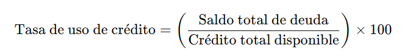
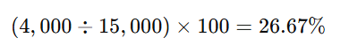

# Cuáles son los principales desafíos que enfrentan las personas al intentar establecer y cumplir objetivos financieros a largo plazo, como la jubilación o la compra de una vivienda, y cómo pueden superar estos obstáculos?

Los principales desafíos que enfrentan las personas al intentar establecer y cumplir objetivos financieros a largo plazo incluyen:

1. **Falta de planificación y educación financiera**
Muchas personas no tienen conocimientos sólidos sobre inversión, presupuestos o planificación financiera, lo que dificulta establecer metas realistas.
- Cómo superarlo:
    - Aprender sobre finanzas personales a través de libros, cursos o asesores financieros.
    - Usar herramientas como hojas de cálculo o aplicaciones de gestión financiera.

2. **Procrastinación y falta de disciplina**
Postergar el ahorro o la inversión puede hacer que se pierda tiempo valioso en la acumulación de capital.
- Cómo superarlo:
    - Automatizar ahorros e inversiones para que se realicen sin intervención manual.
    - Establecer metas SMART (específicas, medibles, alcanzables, relevantes y con un tiempo definido).

3. **Gastos imprevistos y emergencias**
Situaciones inesperadas, como problemas de salud o desempleo, pueden afectar los ahorros destinados a objetivos de largo plazo.
- Cómo superarlo:
    - Crear un fondo de emergencia equivalente a 3-6 meses de gastos.
    - Contratar seguros adecuados para reducir riesgos financieros.

4. **Inflación y cambios económicos**
El aumento en el costo de vida y las crisis económicas pueden reducir el poder adquisitivo del dinero ahorrado.
- Cómo superarlo:
    - Invertir en activos que superen la inflación, como fondos indexados, acciones o bienes raíces.
    - Diversificar inversiones para mitigar riesgos.    

5. **Falta de seguimiento y ajuste de la estrategia**
No revisar periódicamente el progreso puede llevar a desviaciones en el plan financiero.
- Cómo superarlo:
    - Revisar metas y estrategias cada 6-12 meses.
    - Ajustar las inversiones y los ahorros según las condiciones económicas y personales.

6. **Presión social y tentaciones de consumo**
Los hábitos de consumo influenciados por la sociedad pueden hacer que las personas gasten más de lo necesario.
- Cómo superarlo:
    - Priorizar el bienestar financiero sobre el consumo inmediato.
    - Aplicar la "regla de las 48 horas" antes de hacer compras impulsivas.

En resumen, la clave para superar estos desafíos es la **educación financiera, la disciplina y la planificación estratégica** 🚀

--- 
# ¿Qué ventajas ofrecen los fondos mutuos y los ETFs en comparación con la inversión directa en acciones o bonos, especialmente para inversores principiantes?

Los fondos mutuos y los ETFs (fondos cotizados en bolsa) ofrecen varias ventajas sobre la inversión directa en acciones o bonos, especialmente para inversores principiantes. Aquí te explico las principales:

1. **Diversificación instantánea** 🏦📊
- Ventaja: Los fondos mutuos y los ETFs agrupan múltiples activos (acciones, bonos, etc.), lo que reduce el riesgo en comparación con comprar solo unas pocas acciones o bonos.
- Ejemplo: Si inviertes en un ETF del S&P 500, tu dinero se distribuye en 500 empresas diferentes, minimizando el impacto si una empresa tiene malos resultados.

2. **Gestión profesional** 📈👨‍💼
- Ventaja: Los fondos mutuos y algunos ETFs son administrados por expertos financieros que seleccionan y ajustan los activos según las condiciones del mercado.
- Ejemplo: Un fondo de renta fija ajusta su cartera de bonos para optimizar rendimientos y reducir riesgos según las tasas de interés.

3. **Menores costos y accesibilidad** 💰
- Ventaja:
    - **Fondos mutuos**: Permiten invertir con cantidades pequeñas, ideales para principiantes.
    - **ETFs**: Tienen comisiones más bajas que los fondos mutuos y se pueden comprar/vender como acciones.

- Ejemplo: Con $100 puedes invertir en un ETF de tecnología, obteniendo exposición a grandes empresas como Apple y Microsoft sin comprar cada acción individualmente.

4. **Facilidad de compra y venta** 🏦⚡
- Ventaja:
     - **ETFs**: Se negocian en bolsa en tiempo real, como las acciones.
    - **Fondos mutuos**: Se compran/venden al cierre del mercado, pero permiten aportes automáticos.

- Ejemplo: Si quieres vender un ETF de energía renovable, puedes hacerlo en cualquier momento del día con un solo clic.

5. **Reinversión automática de dividendos** 📊🔄
- Ventaja: Muchos fondos mutuos y ETFs permiten reinvertir dividendos automáticamente, aumentando el crecimiento compuesto de la inversión.
- Ejemplo: Si un ETF de dividendos paga $10 en dividendos, esos $10 se reinvierten para comprar más participaciones, generando mayores ganancias a largo plazo.

**Conclusión** 🏆
Para principiantes, los fondos mutuos y ETFs son excelentes opciones porque ofrecen diversificación, costos bajos y gestión profesional.
- Si buscas bajos costos y flexibilidad, los ETFs son mejores.
- Si prefieres gestión activa y reinversión automática, los fondos mutuos pueden ser una opción sólida.

---

# ¿Cuál es uno de los factores menos importantes que afectan tu puntuación de crédito?

Uno de los factores menos importantes que afectan tu puntuación de crédito es la consulta de crédito blanda (soft inquiry).

- ¿Qué es una consulta de crédito blanda?
Es cuando una empresa, institución financiera o tú mismo revisan tu historial crediticio sin que estés solicitando un nuevo crédito.

- Ejemplos de consultas blandas:
    - ✅ Revisar tu propia puntuación en una app financiera (como Credit Karma).
    - ✅ Un empleador que verifica tu historial de crédito como parte de un proceso de contratación.
    - ✅ Una entidad financiera que preaprueba una tarjeta de crédito para enviarte una oferta.

📌 **Importante**: A diferencia de las consultas de crédito duras (hard inquiries), que ocurren cuando solicitas un préstamo o tarjeta de crédito y pueden afectar tu puntaje, las consultas blandas no impactan tu crédito.

Si bien **tienen registro en tu informe crediticio**, no influyen en la calificación porque no representan un riesgo financiero. 🚀

--- 

# ¿Qué significa la tasa de uso de crédito? 

La tasa de uso de crédito (o utilización de crédito) es el porcentaje del crédito disponible que estás utilizando en un momento dado. Es un factor clave en tu puntaje de crédito, ya que representa tu nivel de deuda en relación con tu límite de crédito.

- **Cómo se calcula la tasa de uso de crédito**
Se calcula dividiendo el saldo total de tus tarjetas de crédito entre el crédito total disponible y multiplicando por 100.

📌 **Fórmula**:

- **Ejemplo de cálculo**
Imagina que tienes dos tarjetas de crédito:
- **Tarjeta 1**: Límite de $5,000, saldo usado: $1,500
- **Tarjeta 2**: Límite de $10,000, saldo usado: $2,500

- **Crédito total disponible**: $5,000 + $10,000 = $15,000
- **Saldo total usado**: $1,500 + $2,500 = $4,000

Tasa de uso de crédito:

- **¿Por qué es importante la tasa de uso de crédito?**
    - **Impacta tu puntaje de crédito**: Es uno de los factores más importantes en la calificación crediticia.
    - **Cuanto más baja, mejor**: Se recomienda mantenerla por debajo del 30% para no afectar negativamente tu crédito.
    - **Indica tu nivel de endeudamiento**: Los prestamistas lo usan para evaluar tu capacidad de pago antes de otorgar nuevos créditos.

📌 **Consejo**: Pagar saldos antes del cierre del estado de cuenta puede reducir tu tasa de uso de crédito y mejorar tu puntaje. 🚀

--- 

# ¿Cuál es una estrategia recomendada para mejorar tu puntaje de crédito?
Una de las mejores estrategias para mejorar tu puntaje de crédito es mantener baja tu tasa de uso de crédito (preferiblemente por debajo del 30%).

- Cómo aplicar esta estrategia:
    - ✅ **Paga más de una vez al mes**: Realizar pagos parciales antes del cierre del estado de cuenta reduce el saldo reportado a las agencias de crédito.
    - ✅ **Aumenta tu límite de crédito**: Solicitar un aumento de límite en tus tarjetas (sin gastar más) reduce tu tasa de uso de crédito.
    - ✅ **Usa varias tarjetas de forma equilibrada**: En lugar de cargar todo a una sola tarjeta, reparte tus gastos entre varias.

📌 **Ejemplo**:
- Si tienes un límite total de $10,000 y un saldo de $4,000, tu tasa de uso de crédito es del 40%.
- Si pagas $2,000 antes del cierre del estado de cuenta, tu saldo bajará a $2,000, reduciendo tu tasa al 20% y mejorando tu puntaje.
- Si solicitas un aumento de crédito a $15,000 y mantienes el mismo saldo de $4,000, tu tasa baja al 26.67%.

📌 **Bonus Tip**: También es clave pagar siempre a tiempo, ya que el historial de pagos es el factor más importante en tu puntaje de crédito. 🚀

--- 

# ¿Cuál es un tipo de crédito que puede tener un impacto positivo en tu puntuación de crédito?
Un crédito a plazos (como un préstamo para automóvil, hipoteca o préstamo estudiantil) puede tener un impacto positivo en tu puntuación de crédito si se maneja correctamente.

- **¿Por qué ayuda un crédito a plazos?**
    - ✅ Diversifica tu historial crediticio 📊 – Los prestamistas valoran una combinación de créditos a plazos y créditos rotativos (como tarjetas de crédito). Tener ambos tipos mejora tu perfil crediticio.
    - ✅ Demuestra tu capacidad de pago 💰 – Pagar puntualmente cada mes construye un buen historial de pagos, el factor más importante en tu puntaje.
    - ✅ Puede mejorar tu tasa de uso de crédito 📉 – A diferencia de las tarjetas de crédito, un préstamo a plazos no afecta la tasa de uso de crédito, lo que ayuda a mantener tu puntaje alto.

📌 **Ejemplo práctico**: Si solo tienes tarjetas de crédito, agregar un préstamo estudiantil o un financiamiento de auto y pagarlo puntualmente puede fortalecer tu historial.

🚀 **Clave**: Para maximizar el impacto positivo, asegúrate de hacer todos los pagos a tiempo y evitar deudas excesivas.

--- 

# ¿Cuál es la diferencia entre deuda financiera bruta y deuda financiera neta?
La diferencia entre deuda financiera bruta y deuda financiera neta radica en cómo se contabilizan los activos financieros disponibles en una empresa o individuo para reducir la deuda total.

1. **Deuda Financiera Bruta** 💳
- **Definición**: Es el total de las obligaciones de deuda que una empresa o individuo tiene, sin considerar los activos disponibles.
- **Componentes típicos**: Incluye préstamos bancarios, bonos emitidos, líneas de crédito, préstamos a corto y largo plazo, entre otros.
- **Importancia**: Refleja el monto total de la deuda sin tener en cuenta la capacidad para pagarla (es decir, sin restar los activos líquidos).

2. **Deuda Financiera Neta** 💰
- **Definición**: Es el total de la deuda financiera bruta menos los activos líquidos que una empresa o individuo tiene (por ejemplo, efectivo y equivalentes de efectivo).
- **Fórmula**:

- **Importancia**: Muestra una visión más realista de la carga neta de deuda, ya que tiene en cuenta la disponibilidad de dinero en efectivo o activos líquidos para reducir la deuda.

**¿Por qué es importante?**
- **Deuda Financiera Bruta**: Da una idea del total de la deuda que alguien tiene.
- **Deuda Financiera Neta**: Proporciona una imagen más precisa de cuánto efectivo está disponible para pagar esa deuda, lo que ayuda a evaluar la capacidad real de la persona o empresa para enfrentar sus obligaciones.

💡 **En resumen**: La deuda neta es más útil para evaluar la solvencia real, ya que considera los activos líquidos disponibles para pagar la deuda.

---

# ¿Qué aspectos son relevantes al calcular la deuda financiera de una persona?